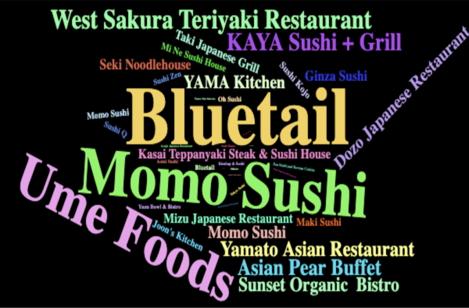
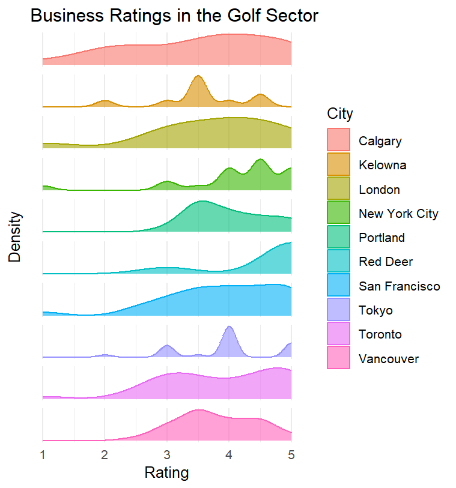

<div align="center">
      
    <h1>YelpViz</h1>
</div>

##### ***The goal of YelpViz is to simplify the visualization process by retrieving business-related information using Yelp's API and providing plotted charts for analysis.***
> ```
> Please ensure that you follow the instructions and refer to the vignette for more details.
> ```
---
## Package Status & Installation  
##### Coverage: 85.48% - 6 functions total included in the `yelpviz_0.1.0.tar.gz` package archive file

To explore different cities and businesses, simply:

* Visit [Yelp Fusion API](https://docs.developer.yelp.com/docs/fusion-intro) to obtain an API key from Yelp
* Install `yelpviz_0.1.0.tar.gz` from package archive file and import from library

## Usage

Once you have completed the steps above,  you may utilize the following 6 functions.

>>> ```  
>>> get_all_businesses  
>>> ```  

This function queries the Yelp Fusion API to search for businesses based on specified criteria. It constructs a request with the provided parameters and fetches business data from Yelp.  
<br>  

```get_all_businesses(api_key, location, business_type, keyword, total = 1000)```  

<br>  
- api_key: A string containing the Yelp API key for authorization  
- location: A string specifying the location to search for businesses  
- business_type: A string specifying the type of business (e.g., restaurants, bars)  
- keyword: A string specifying additional search keywords (e.g., "pizza", "coffee")  
- total: An integer specifying the total number of businesses to attempt to retrieve. The default is 1000  
<br>  

```
# Example usage
all_businesses <- get_all_businesses("your_api_key", "San Francisco", "food", "pizza", total = 200)
print(all_businesses)
```
<br>  
The variable `all_businesses` will be a dataframe that includes the following columns: "id", "alias", "name", "image_url", "is_closed", "url", "review_count", "categories", "rating", "coordinates", "transactions", "price", "location", "phone", "display_phone", "distance". Use this to view the business details, gather summary statistics and exploratory analysis, and/or create custom visualizations to suit your needs.  
<br><br><br>  

>>> ```  
>>> search_businesses  
>>> ```  
<br>  
This function queries the Yelp Fusion API to search for businesses based on specified criteria. It constructs a request with the provided parameters and fetches business data from Yelp, returning a list of businesses that match the search criteria.  
<br>  

`search_businesses(api_key, location, business_type, keyword, offset = 0, limit = 50)`
<br>  
- api_key: A string containing the Yelp API key for authorization  
- location: A string specifying the location to search for businesses  
- business_type: A string specifying the type of business (e.g., restaurants, bars)  
- keyword: A string specifying additional search keywords (e.g., "pizza", "coffee")  
- offset: An integer specifying the offset for pagination. The default is 0  
- limit: An integer specifying the maximum number of results to return. The default is 50, and the maximum is 50 as per Yelp API limits  
<br>
```
# Example usage
businesses <- search_businesses("your_api_key", "San Francisco", "food", "pizza")
print(businesses)
```
<br>  

```
\# Example output
                       id                                                        alias                                          name
1  A9QDUzIGMcybhLhtPDSN4A    gaspares-pizza-house-and-italian-restaurant-san-francisco    Gaspare's Pizza House & Italian Restaurant
2  mSMZJj2pFvttWLpcDmgrEA                         tonys-pizza-napoletana-san-francisco                       Tony's Pizza Napoletana
3  PTFxtXS47ZVRCdZIrEWvGw                               golden-boy-pizza-san-francisco                              Golden Boy Pizza
```
<br><br><br>
>>> ```  
>>> create_word_cloud  
>>> ```  
<br>  
This function generates a word cloud visualization based on the names of businesses, weighted by their ratings and number of reviews. The visualization highlights popular and highly rated businesses more prominently.  
<br>  

`create_word_cloud(data, save_to_file = FALSE, filename = "wordcloud.html")`  
<br>  
- data: A dataframe containing Yelp business data, specifically the business names, ratings, and review counts  
- save_to_file: Logical indicating whether to save the word cloud to an HTML file. Defaults to FALSE, which means the word cloud will be printed instead of saved  
- filename: The name of the file to save the word cloud HTML if save_to_file is TRUE. Defaults to "wordcloud.html"  
<br>  
```
# Example usage
create_word_cloud(df_businesses, TRUE, "my_wordcloud.html")
```  
<br>  

<br><br><br>  

>>> ```  
>>> create_geo_heatmap  
>>> ```  
<br>  
This function creates a geographic heatmap using the Plotly library in R. It takes a dataframe with latitude, longitude, and other relevant data from the function get_all_businesses(), and produces an interactive map.  
<br>  

`create_geo_heatmap(df_loc, factor_plot)`  
<br>  
- df_loc: A dataframe containing location data, including latitude, longitude, and other factors  
- factor_plot: The factor to be represented by the heatmap. The available factors are price_factor, rating, review_count, and weighted_rating_review  
<br>
```
# Example usage
heatmap <- create_geo_heatmap(all_businesses, "price_factor")
heatmap
```  
<br>  
  
<br><br><br>  

>>> ```  
>>> analyze_cities  
>>> ```  
<br>  
This function retrieves business data from Yelp API for specified cities and category, analyzes the ratings, and generates facetted and interactive plots.  
<br>  

`analyze_cities(api_key = NULL, location = NULL, categories = NULL, limit = 20)`  
<br>  
- api_key: A character string representing the Yelp API key. If NULL, the user will be prompted to enter the API key  
- location: A character vector containing the names of cities to analyze. If NULL, the user will be prompted to enter the cities  
- categories: A character string representing the category of businesses to analyze. If NULL, the user will be prompted to enter a category  
- limit: An integer specifying the maximum number of businesses to retrieve per city. Default is 20  
<br>
```
# Example usage with cities  
api_key <- '<<<ENTER API KEY HERE>>>'
location <- c('Kelowna', 'Seattle', 'London', 'Tokyo', 'Calgary', 'Vancouver', 'Toronto', 'Portland', 'New York City', 'San Francisco')
result_cities <- analyze_cities(api_key, location, 'golf', 33)
result_cities$plot_facetted
```  
<br>  
The variable `result_cities` will return a dataframe containing all the golf businesses in each city, the parameters used, and 2 plots (either facetted for separate comparisons, or interactive for an in-depth analysis).  
<br>  
  
<br><br><br>  

>>> ```  
>>> analyze_business_sectors  
>>> ```  
<br>  
This function retrieves business data from Yelp API for a specified city and categories, analyzes the ratings, and generates facetted and interactive plots.  
<br>  

`analyze_business_sectors(api_key = NULL, location = NULL, categories = NULL, limit = 20)`  
<br>  
- api_key: A character string representing the Yelp API key. If NULL, the user will be prompted to enter the API key  
- location: A character string representing the name of the city to analyze. If NULL, the user will be prompted to enter a city  
- categories: A character vector containing the names of categories to analyze. If NULL, the user will be prompted to enter the categories  
- limit: An integer specifying the maximum number of businesses to retrieve per category. Default is 20  
<br>  
```
# Example usage with categories
api_key <- '<<<ENTER API KEY HERE>>>'
categories <- c('food', 'gyms', 'golf', 'shopping', 'hotelstravel', 'nightlife', 'casinos', 'airports', 'roofing', 'plumbing')
result_sectors <- analyze_business_sectors(api_key, 'Kelowna', categories, 33)
result_sectors$plot_interactive
```  
<br>  
The variable `result_sectors` will return a dataframe containing all the business sectors in the city of Kelowna, the parameters used, and 2 plots (either facetted for separate comparisons, or interactive for an in-depth analysis).  
<br>  
  


