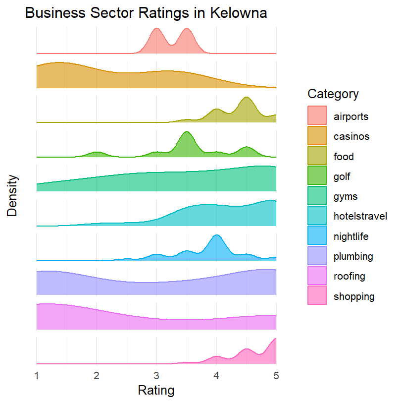

```{r setup, include=FALSE}
knitr::opts_chunk$set(echo = TRUE)
```

# YelpViz API Wrapper

### Getting Started

Installation of the package:
```{r}
library(yelpviz)
```

Install required libraries:
```{r}
library(httr)
library(jsonlite)
library(dplyr)
library(ggplot2)
library(plotly)
library(stringr)
library(tools)
library(RColorBrewer)
library(wordcloud2)
```

### analyze_cities()

To analyze the ratings for different cities based on a single business sector within an interactive density plot, call the analyze_cities function. This retrieves the best matched businesses for that business sector and can accept multiple cities for comparison. For quick analysis, simply call `analyze_cities()` and enter required information when prompted.

**Prompts**\
*"Please enter your Yelp API key: "*\
*"Please enter the cities (separated by commas if multiple): "*\
*"Please enter the category name: "*

***The dataframe, parameter values, and plot are returned.***
```{r}
analyze_cities()
```

Or for more in-depth analysis, the user can set or enter the parameters prior and assign to a variable to be called:\
\
**Required parameters**

| Parameter  | Description          | Default |
|------------|----------------------|---------|
| `api_key`  | Yelp API key         | NULL    |
| `cities`   | List of cities       | NULL    |
| `category` | Business sector      | NULL    |
| `limit`    | Number of businesses | 20      |

```{r}
# Enter the Yelp API key and specify multiple cities in a vector
api_key <- <<<ENTER API KEY HERE>>>
cities <- c('Kelowna', 'Penticton', 'Red Deer', 'Edmonton', 'Calgary', 'Vancouver', 'Toronto', 'Portland', 'New York City', 'San Francisco')

# Assign to a variable for further analysis
result <- analyze_cities(api_key, cities, 'food', 33)
#result$combined_df # uncomment to see the dataframe
#result$parameters # uncomment to see the parameters
#result$plot_facetted # uncomment to see the facetted plot
#result$plot_interactive # uncomment to see the interactive plot
```

**Example output of the plots:**

::: {style="display: flex; justify-content: center;"}
{width="40%"} {width="40%"}
:::

Now the user has the option to create other visualizations, retrieve summary statistics, or view the ratings, review counts, and prices of each business within the business sector.

For example, the mean rating of each city can accessed:
```{r}
# To display how many businesses were actually retrieved for each city
table(result$combined_df$City)

# Replace 'desired_city' with the city you want to summarize
desired_city <- "Kelowna"

# Filter the dataframe based on the 'desired_city'
city_data <- result$combined_df[result$combined_df$City == desired_city, ]

# Display the summary of the filtered data frame
summary(city_data)
```

```
     City               name            review_count      rating         price           price_factor
 Length:10          Length:10          Min.   : 1.0   Min.   :2.000   Length:10          1   :1      
 Class :character   Class :character   1st Qu.: 4.0   1st Qu.:3.500   Class :character   2   :0      
 Mode  :character   Mode  :character   Median : 4.5   Median :3.500   Mode  :character   3   :0      
                                       Mean   : 5.0   Mean   :3.550                      NA's:9      
                                       3rd Qu.: 6.0   3rd Qu.:3.875                                  
                                       Max.   :12.0   Max.   :4.500
```

```{r}
library(dplyr)
# Calculate the mean for each city in the category golf
city_means <- result$combined_df %>%
  group_by(City) %>%
  summarize(mean_review_count = mean(review_count),
            mean_rating = mean(rating))

# Print the mean values for each city
print(city_means)
```

```
# A tibble: 10 × 3
   City          mean_review_count mean_rating
   <chr>                     <dbl>       <dbl>
 1 Calgary                    4.1         3.52
 2 Edmonton                   4.44        3.58
 3 Kelowna                    5           3.55
 4 New York City             33.5         4.14
 5 Penticton                  4.56        3.75
 6 Portland                  39.9         4   
 7 Red Deer                   1.17        4.67
 8 San Francisco             81.7         3.91
 9 Toronto                    4.82        3.89
10 Vancouver                 10.4         3.81
```

### analyze_business_sectors()

To analyze the ratings for different business sectors based on a single city by displaying a stacked-density plot, call the analyze_business_sectors function. This retrieves the best matched businesses for each business sector and can accept a single city for comparison. For quick analysis, simply call `analyze_business_sectors()` and enter required information when prompted.

**Prompts**\
*"Please enter your Yelp API key: "\
"Please enter the city name: "\
"Please enter the categories (separated by commas if multiple): "*

***The dataframe, parameter values, and plot are returned.***
```{r}
analyze_business_sectors()
```

Or for more in-depth analysis, the user can set or enter the parameters prior and assign to a variable to be called:\
\
**Required parameters**

| Parameter    | Description              | Default |
|--------------|--------------------------|---------|
| `api_key`    | Yelp API key             | NULL    |
| `city`       | Single city              | NULL    |
| `categories` | List of business sectors | NULL    |
| `limit`      | Number of businesses     | 20      |

```{r}
# Enter the Yelp API key and specify multiple categories in a vector
api_key <- <<<ENTER API KEY HERE>>>
categories <- c('food', 'gyms', 'golf', 'shopping', 'hotelstravel', 'nightlife', 'casinos', 'airports', 'roofing', 'plumbing')

# Assign to a variable for further analysis
result <- analyze_cities(api_key, 'Kelowna', categories, 33)
#result$combined_df # uncomment to see the dataframe
#result$parameters # uncomment to see the parameters
#result$plot_facetted # uncomment to see the facetted plot
#result$plot_interactive # uncomment to see the interactive plot
```

**Example output of the plots:**

::: {style="display: flex; justify-content: center;"}
{width="40%"} {width="40%"}
:::

Now the user has the option to create other visualizations, retrieve summary statistics, or view the ratings, review counts, and prices of each business sector within the city.

For example, the rating and review count summary statistics of each business sector can accessed:
```{r}
# To display how many businesses were actually retrieved for each category
table(result$combined_df$Category)

# Replace 'desired_category' with the category you want to summarize
desired_category <- "golf"

# Filter the dataframe based on the 'desired_category'
category_data <- result$combined_df[result$combined_df$Category == desired_category, ]

# Display the summary of the filtered data frame
summary(category_data)
```

```         
   Category             name            review_count      rating         price           price_factor
 Length:10          Length:10          Min.   : 1.0   Min.   :2.000   Length:10          1   :1      
 Class :character   Class :character   1st Qu.: 4.0   1st Qu.:3.500   Class :character   2   :0      
 Mode  :character   Mode  :character   Median : 4.5   Median :3.500   Mode  :character   3   :0      
                                       Mean   : 5.0   Mean   :3.550                      NA's:9      
                                       3rd Qu.: 6.0   3rd Qu.:3.875                                  
                                       Max.   :12.0   Max.   :4.500
```

```{r}
library(dplyr)
# Calculate the mean for each category in the City of Kelowna
category_means <- result$combined_df %>%
  group_by(Category) %>%
  summarize(mean_review_count = mean(review_count),
            mean_rating = mean(rating))

# Print the mean values for each category
print(category_means)
```

```
# A tibble: 10 × 3
   Category     mean_review_count mean_rating
   <chr>                    <dbl>       <dbl>
 1 airports                 23           3.25
 2 casinos                   4.4         2.1
 3 food                     33.2         4.38
 4 golf                      5           3.55
 5 gyms                      3.59        3.59
 6 hotelstravel             13.3         4.17
 7 nightlife                46.1         3.86
 8 plumbing                  2.83        3.07
 9 roofing                   1.9         2.5
10 shopping                  4.18        4.65
```


### create_geo_heatmap()

To analyze the specific businesses in an area by displaying a map with heat map of the factor values, including rating, price, review_counts, and weighted rating and review count, call the `create_geo_heatmap()` with data returned by the `get_all_businesses()` and an interesting factor. This will plot the a map with gradient color bubbles for each businesses.  

**Required parameters**

| Parameter    | Description              | Default |
|--------------|--------------------------|---------|
| `df_loc`     | data returned by `get_all_businesses`| NULL    |
| `factor_plot`| factor for plotting      | NULL    |


```{r}
# Enter the Yelp API key and specify multiple categories in a vector
api_key <- <<<ENTER API KEY HERE>>>

# Get data from the get_all_businesses function
df_business <- get_all_businesses(api_key, "Vancouver", "Restaurant", "italian")

# Create visualization of geo-heatmap
fig <- create_geo_heatmap(df_business, factor_plot="price_factor")
fig
# fig2 <- create_geo_heatmap(df_business, factor_plot="review_count")
# fig2
# fig3 <- create_geo_heatmap(df_business, factor_plot="rating")
# fig3
# fig4 <- create_geo_heatmap(df_business, factor_plot="weighted_rating_review")
# fig4
```

**Example output of the plots:**

::: {style="display: flex; justify-content: center;"}
{width="40%"}


### get_all_businesses()

To retrieve all businesses matching specific criteria from the Yelp Fusion API, use the `get_all_businesses()` function. This function iterates over paginated search results, collecting businesses that match the given search criteria up to a specified total number of businesses.

**Required Parameters**

| Parameter       | Description                                               | Default |
|-----------------|-----------------------------------------------------------|---------|
| `api_key`       | String containing the Yelp API key for authorization.     | NULL    |
| `location`      | String specifying the location to search for businesses.  | NULL    |
| `business_type` | String specifying the type of business to search for.     | NULL    |
| `keyword`       | String specifying additional search keywords.             | NULL    |
| `total`         | Integer specifying the total number of businesses to retrieve. | 1000  |

**Example Usage**

```r
api_key <- "<<<ENTER API KEY HERE>>>"
df_businesses <- get_all_businesses(api_key, "San Francisco", "food", "pizza", total = 1000)
```

## search_businesses()

This function queries the Yelp Fusion API to search for businesses based on specified criteria, such as location and business type. It constructs a request with the provided parameters and fetches business data from Yelp.

**Required Parameters**

| Parameter       | Description                                                   | Default |
|-----------------|---------------------------------------------------------------|---------|
| `api_key`       | String containing the Yelp API key for authorization.         | NULL    |
| `location`      | String specifying the location to search for businesses.      | NULL    |
| `business_type` | String specifying the type of business (e.g., restaurants, bars). | NULL   |
| `keyword`       | String specifying additional search keywords (e.g., "pizza", "coffee"). | NULL |
| `offset`        | Integer specifying the offset for pagination.                 | 0       |
| `limit`         | Integer specifying the maximum number of results to return (max is 50 as per Yelp API limits). | 50  |

**Example Usage**

```r
api_key <- "<<<ENTER API KEY HERE>>>"
business_list <- search_businesses(api_key, "San Francisco", "food", "pizza")
```

## create_word_cloud()

To generate a word cloud visualization from Yelp business data, use the `create_word_cloud()` function. This function takes business data as input and produces a word cloud, where the size of each business name is determined by a weighted combination of its rating and the number of reviews. The function allows for the word cloud to be saved as an HTML file if desired.

**Required Parameters**

| Parameter      | Description                                                   | Default         |
|----------------|---------------------------------------------------------------|-----------------|
| `data`         | DataFrame containing Yelp business information.               | NULL            |
| `save_to_file` | Boolean indicating whether to save the word cloud as an HTML file. | FALSE         |
| `filename`     | String specifying the name of the file to save the word cloud to. | "wordcloud.html" |

**Example Usage**

```r
# Assuming `business_data` is a DataFrame with Yelp business info
create_word_cloud(business_data, TRUE, "my_wordcloud.html")
```

This function extracts the `name`, `rating`, and `review_count` from the input data to calculate weights for the word cloud. The weights are normalized to ensure a visually appealing distribution of word sizes. The word cloud can be customized in terms of size, color, and background color. If `save_to_file` is set to `TRUE`, the word cloud is saved to the specified filename; otherwise, it is printed directly in the R console.
